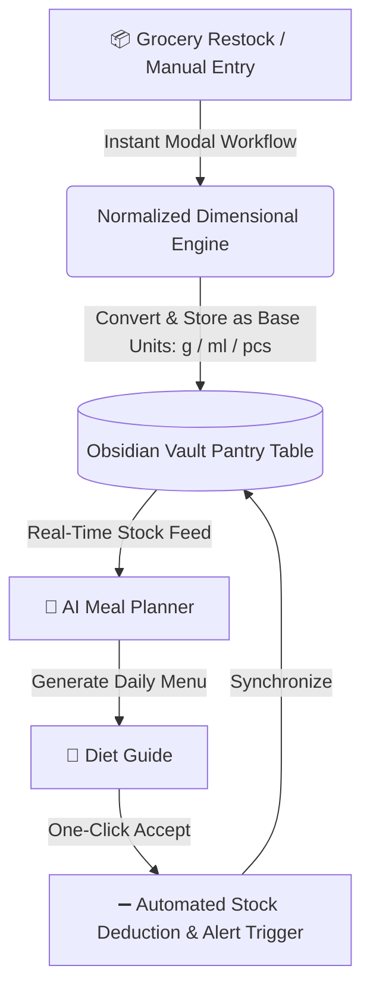

# 🥗 PantryFin
### The Next-Generation AI Culinary & Inventory Engine for Obsidian

*“Ingredients flow from your pantry to your plate like a fin through water.”*  
**Effortlessly connect what’s in your kitchen to your daily nutrition goals with intelligent, automated precision.**

---

## ✨ Overview

**PantryFin** transforms Obsidian into an autonomous, intelligent kitchen and nutrition management system. Built from the ground up around a **Normalized Base-Unit Engine** and a **Reactive 12-Column Live Dashboard**, PantryFin eliminates manual calculation errors, chaotic unit tracking, and disconnected meal logs.

Whether you are logging groceries, asking your personal AI nutritionist for a high-protein dinner plan, or tracking complex macro goals, PantryFin bridges the gap between raw ingredient inventory and healthy living.

---

## 🌟 Key Features

### 📦 1. Normalized Base-Unit Inventory Engine
Traditional grocery tracking breaks down when mixing units like `1.5 kg`, `500 g`, `1 L`, and `250 ml`. PantryFin solves this with a robust physical dimensional engine:
- **Intelligent Unit Normalization**: Automatically converts and standardizes natural language inputs into base SI dimensions (`g` for weight, `ml` for volume, `pcs` for counts). Whether you type `1.5KG`, `500g`, `1L`, or conversational units, PantryFin computes them with zero data loss.
- **Flawless Inventory Addition & Deduction**: By decoupling raw values from display formatting, stock additions and recipe subtractions execute with pure mathematical precision—preventing floating-point drift and negative stock bugs.
- **Isolated Interactive Modals**: Stock operations happen in dedicated, lightweight modals that guarantee focus retention and seamless workflow execution without disrupting your open dashboard.

### 🤖 2. Interactive AI Nutrition Butler & Planner
- **On-Demand AI Butler**: Chat directly with your culinary AI right inside Obsidian. Ask questions like: *"What high-protein meal can I make with my expiring chicken and spinach?"* or *"Help me plan a 1,800 kcal cutting day."*
- **One-Click Recipe Execution**: When AI generates a daily meal plan, simply accept it with one click. PantryFin automatically calculates item amounts, subtracts exact ingredient quantities from your live pantry, and warns you of low inventory.

### 🥑 3. Embedded Offline USDA/FDC Nutrition Database
- **Instant Offline Macro Tracking**: Packed with an embedded, lightning-fast **4.0 MB USDA/FDC food database** and optimized snapshot indexes.
- Calculate calories, proteins, carbohydrates, and fats instantly without relying on external internet connections or slow APIs.

### 🎨 4. Adaptive 12-Column Live Dashboard
Designed with modern SaaS aesthetics and fully optimized for both desktop and mobile layouts:
1. **💬 Butler Chat**: Your command center for AI dialogue and quick instructions.
2. **🎯 Meal Tracker**: Live progress bars tracking calorie goals and macronutrient distribution.
3. **📖 Diet Guide**: Daily meal blueprints and quick execution buttons.
4. **✅ Tasks**: Kitchen prep, grocery reminders, and thawing checklists.
5. **📦 Live Pantry**: Color-coded category pills (Meats, Veggies, Carbs, Supplements) offering instant visibility into stock levels and out-of-stock alerts.

---

## 📸 Architectural Workflow

---

## 🛠️ Installation

1. Download the latest release package **`pantryfin-v2.0.0.zip`**.
2. Navigate to your Obsidian vault's plugin directory: `.obsidian/plugins/`.
3. Create a new folder named `pantryfin`.
4. Extract the following distribution files into the `pantryfin` folder:
   - `main.js` (Compiled Engine)
   - `styles.css` (Responsive UI Styles)
   - `manifest.json` (Plugin Metadata)
   - `README.md` (Documentation)
   - `fdc-data.json` (Embedded Nutrition Database)
   - `fdc-mini-index.json` (High-Speed Index)
5. Restart Obsidian, or navigate to **Settings -> Community Plugins** and enable **PantryFin**.

---

## 🚀 Quick Start Guide

1. **Set Your Target**: Open the PantryFin dashboard from the left ribbon icon. Configure your daily calorie target (e.g., `2,000 kcal`) in the settings.
2. **Stock Your Kitchen**:
   - Click the **`➕ Restock`** button on the Pantry card.
   - Enter items naturally: e.g., Name: `Beef`, Quantity: `1.5KG`; Name: `Whole Milk`, Quantity: `1L`. PantryFin records them automatically as `1500g` and `1000ml`.
3. **Plan Your Day**:
   - Ask the Butler Chat: *"Create a balanced dinner using beef and milk under 600 kcal."*
4. **Cook & Track**:
   - Click **Accept & Deduct** on any generated meal plan to update your pantry instantly, or click individual ingredient pills for quick, custom consumption logging.

---

## 🧪 Quality & Reliability

- **Backed by 62 Comprehensive Unit Tests**: Every aspect of unit normalization, natural language parsing, and non-destructive stock reduction is continuously verified.
- **Idempotent & Native Obsidian Integration**: Built cleanly on Obsidian's official `ItemView` and `Modal` APIs, guaranteeing zero corruption to personal markdown files outside the plugin's designated workspace.

---

Crafted with ❤️ for culinary creators and Obsidian power users.

